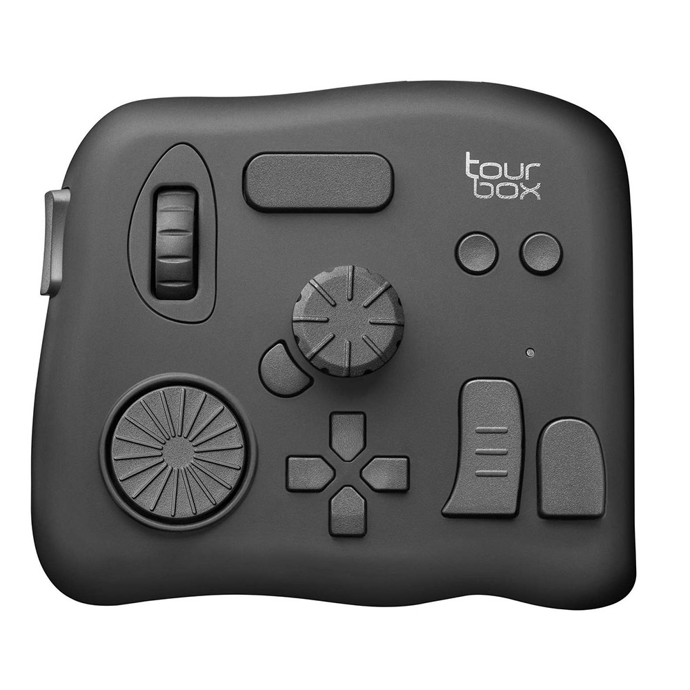

# About

This is a simple Linux driver (written in C++) for the [Tourbox Neo](https://www.tourboxtech.com/en/product.html). (The manufacturer frustratingly refused to provide a Linux driver, so I decided to write one)

This driver lets you use the device as a rudimentary keyboard and mouse combo -- the D-pad controls a virtual mouse, and the various keys perform different functions (see `docs` folder for full list).

# Usage

Compile the driver via C-Make.

```bash
$ cmake CMakeLists.txt
$ make
```

In a separate window, open `dmesg`.

Since the device will be writing to `/dev/uinput`, you need to either:

(a) Run the executable (Tourbox_Linux_Driver) as root

(b) Change the permissions on `/dev/uinput`

Whatever you decide to do, after running the executable you should see an entry in the `dmesg` wnidow with the device:

```
input: Custom Tourbox TBG_H Driver (Keyboard/Mouse) as /devices/virtual/input/input48
```

This tells you it's ready for use. When you're ready to stop using the driver, simply Ctrl + C (SIGINT) the program

If you'd like to change the functionality provided by the driver, you can use Xmodmap to create your own keymap.

