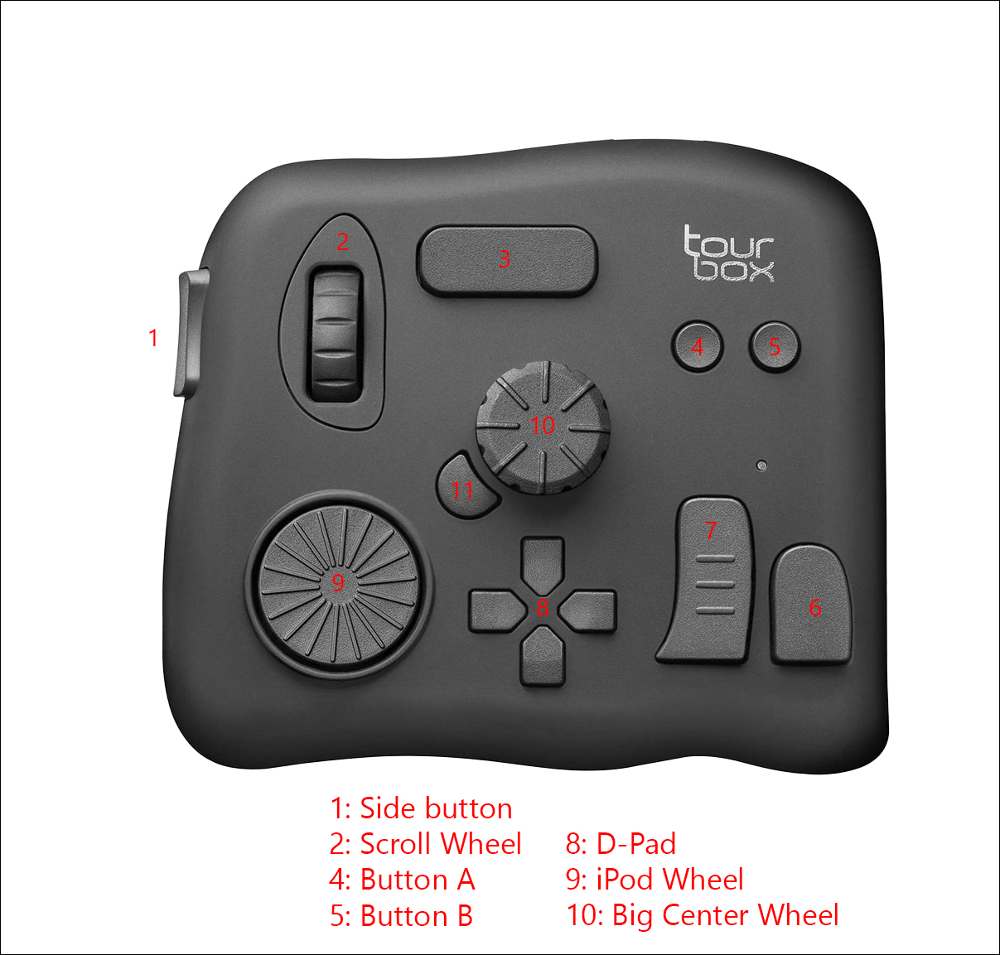

# Button Mapping

| Button name                       | 'Scan Code' (serial) | Key mapped |
|-----------------------------------|----------------------|------------|
| SIDE_BUTTON                       | 81                   |            |
| SCROLL_WHEEL_UP                   | [49][c9]             |            |
| SCROLL_WHEEL_DOWN                 | [09][89]             |            |
| SCROLL_WHEEL_CLICK                | [0a][8a]             |            |
| BUTTON_3                          | 82                   |            |
| BUTTON_A                          | [22][a2]             |            |
| BUTTON_B                          | [23][a3]             |            |
| BUTTON_6                          | 83                   |            |
| BUTTON_7                          | 80                   |            |
| BUTTON_DPAD_UP                    | 90                   |            |
| BUTTON_DPAD_RIGHT                 | 93                   |            |
| BUTTON_DPAD_DOWN                  | 91                   |            |
| BUTTON_DPAD_LEFT                  | 92                   |            |
| IPOD_WHEEL_CLOCKWISE              | 8f                   |            |
| IPOD_WHEEL_COUNTERCLOCKWISE       | [4f][cf]             |            |
| BIG_CENTER_WHEEL_CLOCKWISE        | [44][c4]             |            |
| BIG_CENTER_WHEEL_COUNTERCLOCKWISE | 84                   |            |
| BUTTON_11                         | [2a][aa]             |            |

